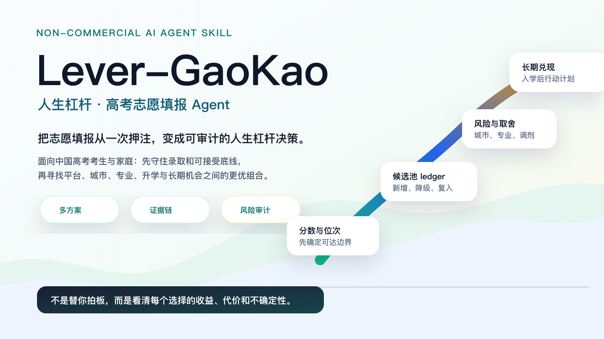
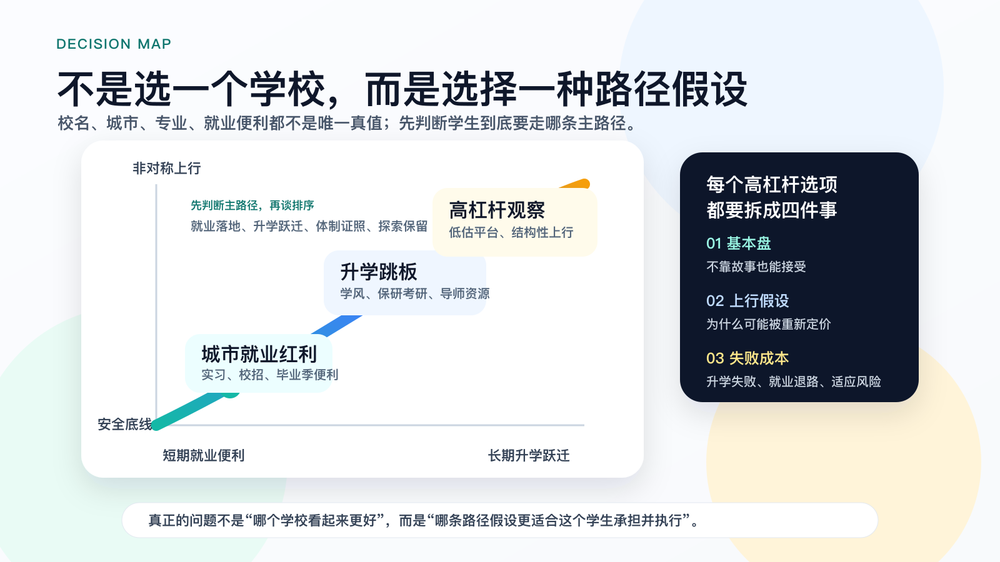
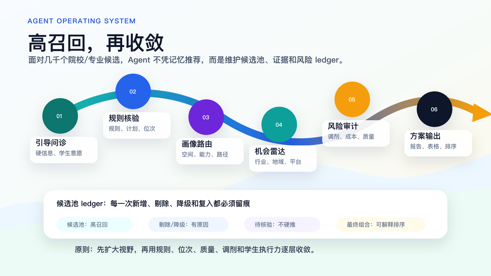

# Lever-GaoKao

*Life Leverage for College Admission*

**人生杠杆・高考志愿填报 Agent**



`Lever-GaoKao` 是一个面向中国高考志愿填报的非商用 AI Agent Skill。它帮助考生和家庭把分数、位次、省份规则、院校专业、家庭约束和长期人生机会放进同一张决策地图，而不是只凭热门叙事或焦虑做决定。

`Lever-GaoKao` 是对外品牌名；`lever-gaokao` 是 Skill id、目录名、命令调用名和 GitHub topic。

## 先看三句话

- 这不是全国院校数据库，也不是已校准的录取概率模型。
- 正式填报必须以省级考试院、高校招生网、招生章程和官方志愿系统为准。
- 本项目强调“多方案 + 证据 + 风险审计”，不制造唯一正确答案。

## 项目来源

这个项目来自一次真实的 2025 年高考志愿填报实践：一名选择空间不宽的考生，在 AI Agent 辅助下从数百个候选院校和专业路径中反复扩展、筛选、降级、复核，最终选择了一个基本盘稳妥、同时具备结构性上行空间的方案。结果不是“神预测”，而是验证了一个朴素方法：先守住录取和可接受底线，再寻找非对称的人生杠杆机会。

具体个案不可复制，但方法可以沉淀：用 Agent 管理候选池、信源、规则、风险、家庭约束和长期路径，而不是让考生在信息噪音里独自下注。

## 适合谁

- 高考考生、家长、老师和公益志愿填报协助者。
- 使用 Codex、Claude Code、Cursor、Kimi Code、OpenCode、Gemini CLI、Qwen Code、Aider、Cline/Roo Code、Continue、Zed/Zcoe、Windsurf、GitHub Copilot Coding Agent、Trae 等工具的人。
- 不满足于“热门城市 + 热门专业 + 唯一推荐”，希望获得可核验、多视角、可执行建议的人。

## 怎么开始

### 1. 准备资料

至少准备：省份、年份、选科/科类、分数、位次、批次、预算、不可接受项、学生本人偏好、家庭约束。

只给“省份 + 分数”时，Agent 只能粗筛，并应优先追问位次、选科、批次和关键限制。

### 2. 让 Agent 读取 Skill

Codex 用户可以使用：

```text
使用 $lever-gaokao 为一名中国高考考生生成证据驱动、风险可控、兼顾长期人生杠杆的志愿填报建议。
```

通用 Agent 用户可以让工具先读取 [Skill 入口](lever-gaokao/SKILL.md)，再按路由读取 `references/`。不要一次性把所有文档塞进上下文。

### 3. 有表格时跑机械校验

```bash
PYTHONDONTWRITEBYTECODE=1 python3 -B lever-gaokao/scripts/ledger_tool.py selftest
python3 lever-gaokao/scripts/ledger_tool.py template --output candidates.csv
python3 lever-gaokao/scripts/ledger_tool.py validate-candidate-table candidates.csv
```

脚本只做字段、状态、硬约束和 ledger 校验，不判断学校质量，也不预测录取概率。

## 没有网络代理怎么办

可以使用支持本地文件读取、工具调用或自定义模型 API 的国产/开源 Agent 工具。国内模型可考虑 GLM、DeepSeek、Kimi、Qwen 等；常见方式是选择支持 OpenAI-compatible 接口的工具，配置 `base_url`、`api_key` 和 `model`。

如果只能使用网页聊天，也可以复制 [SKILL.md](lever-gaokao/SKILL.md)、[引导式问诊](lever-gaokao/references/guided-intake.md) 和 [输入输出规范](lever-gaokao/references/input-output-schema.md) 的相关片段，让模型先问诊再分析。这样能轻量使用方法论，但无法自动跑候选表脚本。

## 选择哲学



核心不是押中某个偶然机会，而是在安全边界内识别当前可进入、基本盘可接受、未来可能被重新定价的结构性机会。

## 运行闭环



完整任务会经历：问诊输入、规则核验、画像路由、宏观变量扫描、候选池 ledger、风险审计、子代理审查、报告/表格输出和入学后复核。简单任务会按渐进式披露压缩流程。

## 核心文档

- [Skill 入口](lever-gaokao/SKILL.md)
- [引导式问诊](lever-gaokao/references/guided-intake.md)
- [选择哲学与方法论](lever-gaokao/references/methodology.md)
- [候选池发现与收敛](lever-gaokao/references/candidate-discovery-and-convergence.md)
- [输入输出规范](lever-gaokao/references/input-output-schema.md)
- [数据与模型路线图](lever-gaokao/references/data-and-model-roadmap.md)
- [候选表工具](lever-gaokao/scripts/ledger_tool.py)

## 不要这样用

- 不要只给一个分数，就要求唯一答案。
- 不要把第三方工具的概率当成官方录取保证。
- 不要上传身份证号、准考证号、手机号、完整住址等敏感信息。
- 不要让商业志愿填报机构把本项目包装成付费服务。
- 不要把“升格、合并、更名、捡漏、热门 AI 专业”当作确定收益。

## 源码开放但非商用

本项目是公益导向的“源码开放、非商用”项目，不是 OSI 定义下的无限制开源项目。

- 文档、Skill、方法论和模板：采用 [CC BY-NC-SA 4.0](LICENSES/CC-BY-NC-SA-4.0.txt)。
- 脚本代码：采用 [PolyForm Noncommercial 1.0.0](LICENSES/PolyForm-Noncommercial-1.0.0.md)。

商业志愿填报咨询机构、教育咨询公司、SaaS 平台、付费知识产品、内部商业工具和其他营利性服务，不得基于本项目进行二次开发、集成、训练、包装或付费交付，除非获得项目维护者的单独书面授权。详见 [LICENSE](LICENSE)、[NONCOMMERCIAL.md](NONCOMMERCIAL.md) 和 [DISCLAIMER.md](DISCLAIMER.md)。

## 贡献

欢迎公益方向的规则补充、信源核验、文档改进、脚本修复和压力测试。请先阅读 [CONTRIBUTING.md](CONTRIBUTING.md)。不要提交任何真实考生隐私信息。
