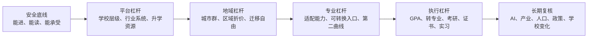
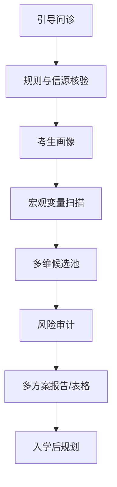
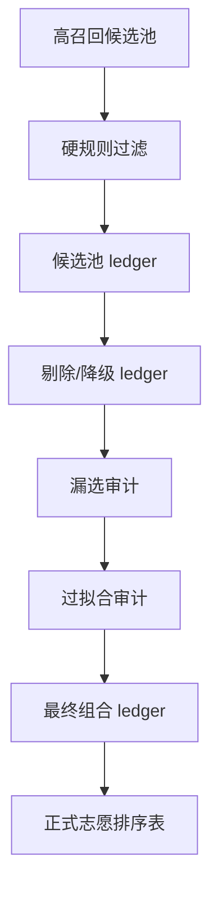

# 人生志愿杠杆 Life Leverage for College Admission


面向中国高考志愿填报的非商用 AI Agent Skill。它不是“替你拍板”的神谕，而是一套帮助考生和家庭把分数、位次、省份规则、院校专业、家庭约束和长期人生机会放在同一张决策地图里的方法与工具。

> **重要边界**  
> 本项目不是全国院校数据库，不是已回测校准的录取概率模型，也不替代省级考试院、高校招生网和官方招生章程。没有完整官方招生计划、历史位次、专业组变化和模型回测时，只能输出候选发现、风险审计、情景模拟、概率区间和待核验事项。

## 给谁用

- 高考考生、家长、老师、公益志愿填报协助者。
- 已经在使用 AI Agent 工具的人，例如 Codex、Claude Code、Cursor、Kimi Code、OpenCode、Gemini CLI、Qwen Code、Aider、Cline/Roo Code、Continue、Zed/Zcoe、Windsurf、GitHub Copilot Coding Agent、Trae 等。
- 希望用证据和结构化判断辅助志愿填报，而不是被热门城市、热门专业、短视频叙事或“唯一正确答案”牵着走的人。

## 立即使用

### Codex Skill

把 `life-leverage-college-admission/` 作为 Skill 安装或复制到你的 Codex Skill 目录，然后在对话中使用：

```text
使用 $life-leverage-college-admission 为一名中国高考考生生成证据驱动、风险可控、兼顾长期人生杠杆的志愿填报建议。
```

### 通用 AI Agent

让你的 Agent 读取：

- [Skill 入口](life-leverage-college-admission/SKILL.md)
- [引导式问诊](life-leverage-college-admission/references/guided-intake.md)
- [输入输出规范](life-leverage-college-admission/references/input-output-schema.md)
- [数据与模型路线图](life-leverage-college-admission/references/data-and-model-roadmap.md)

然后按 `SKILL.md` 的渐进式披露路由读取其他 reference。不要一次性把所有文档塞进上下文。

### 候选表工具

如果你已经整理了候选 CSV，可以用脚本做机械校验：

```bash
PYTHONDONTWRITEBYTECODE=1 python3 life-leverage-college-admission/scripts/ledger_tool.py selftest
python3 life-leverage-college-admission/scripts/ledger_tool.py template --output candidates.csv
python3 life-leverage-college-admission/scripts/ledger_tool.py validate-candidate-table candidates.csv
```

脚本只做字段、状态、硬约束和 ledger 校验，不判断学校质量，也不预测录取概率。

## 最小资料清单

开始前尽量准备：

| 信息 | 说明 |
| --- | --- |
| 省份和年份 | 不同省份、年份规则可能不同 |
| 选科/科类 | 新高考选科、传统文理、艺体专项等 |
| 分数和位次 | 位次优先于分数 |
| 批次 | 本科批、专科批、提前批、专项等 |
| 家庭预算 | 学费、生活费、民办/中外合作容忍度 |
| 不可接受项 | 地区、专业、学费、调剂下限、身体限制 |
| 学生本人偏好 | 兴趣、短板、职业想象、城市接受度 |
| 家庭约束 | 家长期望、照护责任、资源、应急储备 |

只给“省份 + 分数”时，本项目只能做粗筛，会优先提示补齐位次、选科、批次和家庭约束。

## 方法论：选择哲学六轴



核心不是押中某个“神校”，而是在安全边界内识别当前可进入、基本盘可接受、未来可能被重新定价的结构性机会。

## 工作流





## 不要这样用

- 不要只给一个分数，就要求唯一答案。
- 不要把第三方工具的概率当成官方录取保证。
- 不要上传身份证号、准考证号、手机号、完整住址等敏感信息。
- 不要让商业志愿填报机构把本项目包装成付费服务。
- 不要把“升格、合并、更名、捡漏、热门 AI 专业”当作确定收益。

## 源码开放但非商用

本项目是公益导向的“源码开放、非商用”项目，不是 OSI 定义下的无限制开源项目。

- 文档、Skill、方法论和模板：采用 [CC BY-NC-SA 4.0](LICENSES/CC-BY-NC-SA-4.0.txt)。
- 脚本代码：采用 [PolyForm Noncommercial 1.0.0](LICENSES/PolyForm-Noncommercial-1.0.0.md)。
- 详情见 [LICENSE](LICENSE) 和 [非商用声明](NONCOMMERCIAL.md)。

商业志愿填报咨询机构、教育咨询公司、SaaS 平台、付费知识产品、内部商业工具和其他营利性服务，不得基于本项目进行二次开发、集成、训练、包装或付费交付，除非获得项目维护者的单独书面授权。

## 责任边界

本项目只提供教育决策辅助，不提供录取承诺、结果保证或人生发展保证。正式填报必须以省级考试院、高校招生网、招生章程和官方志愿系统为准。详见 [DISCLAIMER.md](DISCLAIMER.md)。

## GitHub 发现性信息

建议仓库 About：

```text
Non-commercial AI Agent Skill for evidence-driven Chinese Gaokao college admission planning.
```

建议 topics：

```text
gaokao, college-admission, china-education, ai-agent, agent-skill, codex, claude-code, cursor, decision-support, noncommercial, education, prompt-engineering, college-planning, admissions, chinese, public-interest
```

没有远端仓库或 `owner/repo` 前，不应执行 GitHub About、topics 或 homepage 远端修改。

## 贡献

欢迎公益方向的规则补充、信源核验、文档改进、脚本修复和压力测试。请先阅读 [CONTRIBUTING.md](CONTRIBUTING.md)。不要提交任何真实考生隐私信息。

